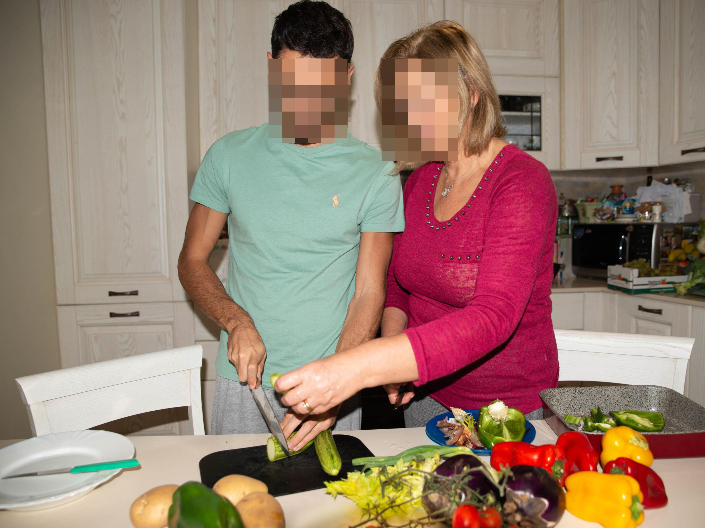
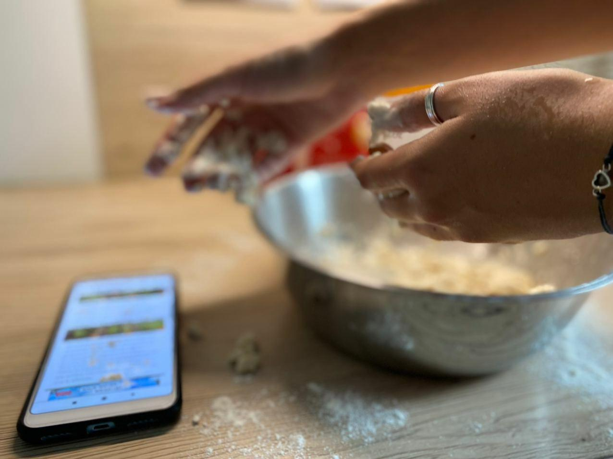
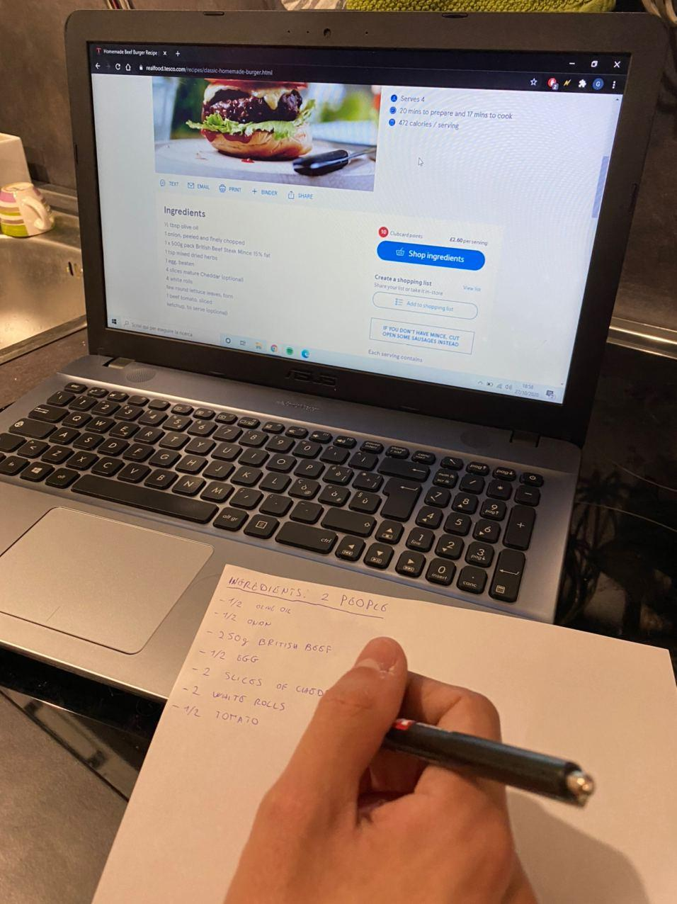

# Milestone 1: Project description and Needfinding: Clean Kitchen

## Overview and planning

Quoting our original idea
> We would like to help **amateur cooks** [...]

The target group for this project includes amateur cooks who like to try new recipes. 
They have to be technically well equipped, meaning they should have a phone/tablet and they should know how to use it well enough (e.g. to look for recipes on the internet). 
For the sake of simplicity for this project, we won't consider people with disabilities and the project will be localized in English.

The people we chose to observe have different backgrounds, some of them have been cooking for a long time and some have not, some of them love to try and experiment with new recipes and some are more cautious, some of them cook because they love to, some because they need to.

> [...] while they're **cooking**.

We chose to focus on the cooking process as the main activity. 

## Observation
The interviewees were asked to cook a new recipe of their choice. 

 #### *Observation: Nicola (M, 24, cooks since he was 12, has been cooking new recipes for 6 years)*
Nicola is browsing YouTube to look for some recipes to cook. He has a list where he adds some dishes he finds interesting while browsing the web or going to the restaurants, today he picked one from there. 
He then goes to wash his hands and comes back to prepare all the ingredients, setting them up on the table. 
Before starting, he goes back to Youtube to look again at the first steps. He finally starts. [...] 
After some time he calls his mom because he needs some help to figure out what he has to do next. [...] 
Whenever he needs to use his phone to check the recipe, he either tries to awkwardly use its knuckles, or he goes to wash his hands.
The rest of the cooking went on without any useful events.

 #### *Observation: Sara (F, 23, loves cooking shows)*
Sara is trying to remake a cake recipe she has seen in the last episode of Masterchef but she is not sure about the procedure, so she is searching something similar on the web. She has found the recipe and now she is preparing all the needed ingredients, doing some proportions of the doses in order to obtain a smaller cake.  
She is watching the video of the recipe before starting to cook. Then she scrolls down the website in the section of the written recipe and she starts cooking. [...] 
While she is cooking she frequently looks at her phone to check if she is following all the steps in the right way. Since the recipe is not fitting the whole phone screen she needs to touch her phone every time she completes some tasks.  

 #### *Observation: Busra (F, 25, enjoys cooking her own meal and trying different recipes of different cultures)*
Busra cooks her own meal every single day, because the pandemic prevents her from ordering meals. Thinking about what to cook everyday is a boring process for her and it leads her to cook easy recipes that she already knows. After a while, she was tired of eating the same kind of meals and decided to cook something different, maybe belonging to a different cuisine. She went to wash her hands and then prepared the kitchen to make it ready for cooking. She surfed on the web quickly and found a tempting Mexican recipe. She started scrolling on the recipe and bringing the demanded ingredients from the fridge one by one. Lemon? Checked! Tomatoes? Checked! Onion? Checked. However, she suddenly realized that this recipe was also demanding uncommon ingredients, like most of the time happens. She closed the recipe and decided to stick with her old recipes, to be able to cook with the ingredients she has.

 #### *Observation: Giovanni (M, 21, cooks since he started to study at the University, he doesn’t have a lot of experience and so he has to read often recipes)*
- Giovanni searched a recipe on YouTube and he started watching it before start cooking.
- He disinfected the kitchen and he washed his hands
- He prepared the pans and the food
- He started to cook but he watched again a piece of video because he didn’t remember how to cut potatos. 
- He washed again his hands
- While he was cooking he set the table and he cleaned the floors to gain time
- He washed his hands
- He ended to cook

|  |  |
:-------------------------:|:-------------------------:
   *Help may be needed for a difficult step of the recipe* |   *Need to keep washing hands when looking at the recipe* 
  *Recipes can demand extraordinary things, which may be not readily available* |   Ingredients quantities may have to be adapted
### Interviews
#### *Questions*
1. Can you explain to me what steps you follow when you have to cook? (in general)
2. Do you usually use recipes when you have to cook something new? 
    * Where do you look for new recipes? 
    * Do you prefer watching some videos or just reading them on a website? Why?
    * Do you read/watch the recipes before cooking or while cooking?  
3. What do you like about online recipes? And what you don’t?
4. Do you have any good/bad experiences about cooking new recipes to share?
5. Does the Covid-19 affect your cooking behaviours?
6. Is there something else we didn’t ask you that you want to talk about?
#### *Answers* 
**Q: Can you explain to me what steps you follow when you have to cook? (in general)**

>Sara: “First of all I check which foods are available at home so that I can decide what to cook. If I’m not sure about the recipe process I’ll search it on the web. Sometime I’ll search for a recipe starting from the ingredients I have.” 

>Nicola: ”I wash my hands, lay all the ingredients on the table and then I’ll start cooking.”

>Busra: “Once I have washed my hands, If I try to cook something that I already know how to cook, I prepare relevant ingredients and start to cook. If I try to cook something that I have never tried before, I google it first and explore what kind of ingredients I need. If I already have what it takes, I prepare them and start cooking, meanwhile following the recipe.”

>Giovanni: “I prepare pots and pans, I set the table, I put the food on the table and I start cooking.”

**Q: Do you usually use recipes when you have to cook something new?**

>Sara: “Yes, if it’s something new, but usually I don’t follow it exactly because I like to modify the recipe according to my taste. 
I usually search recipes on websites or social networks.  
I don’t like to have lots of instructions to read. I prefer watching photos or videos with some short descriptions.  
Usually I start observing all the steps of the recipe. While I’m cooking I need to read it another time to be sure I’m doing it right.”

>Nicola: ”Yes, I usually look for new recipes on Youtube, or GialloZafferano, too. I prefer to watch some videos, they tend to explain things better, they show you every step of the recipe. Written recipes often have some technical wording I don’t understand or mention specific tools I don’t have, so watching a video I’m able to better understand what I have to do and find solutions or workarounds based on what they’re doing in the video. 
I’ll watch the recipe beforehand, then I’ll watch it again while I’m cooking if I don’t remember something.”

>Busra: “Most of the time, yes. Sometimes, I try to generate new recipes based on the ingredients I have for that moment.
If I am looking for a dish that I do not know how to prepare, usually I use Google for it. Besides, there are a bunch of channels and pages that I enjoy to follow on Youtube and Instagram. 
If I am in a rush, I prefer to read on a website. Otherwise, I like to watch video contents. 
First of all, I read/watch the recipe in order to prepare the ingredients. Then I check them while cooking, so as not to miss any step.”

>Giovanni: “Yes. Usually I look for new recipes on Instagram and Youtube. I look for inspiration from Instagram and I search recipes that I just decide to make on Youtube. I prefer watching videos, they’re more practice and engaging than written recipes. I watch recipes before cooking and if I don’t remember something I watch it again while I’m cooking.”

**Q: What do you like about online recipes? And what you don’t?**

>Sara: “I like online recipes because they are often more clear: you can choose to watch the video recipe or you can just read the steps and start cooking. I don’t like not being able to see the whole recipe on the screen without touching the mobile phone.”

>Nicola: ”I like that they teach you how to do new things, and they’re good at it. There are photos, videos, things you don’t have in old cookbooks. If I get my hands on some cookbooks I may use them for inspiration, but even then I always browse the internet afterwards.”

>Busra: “The thing that I do not like about online recipes is that sometimes -especially if the recipe has been written by a professional- it is not possible to access all of the demanded ingredients in the home environment. However, one of the reasons that I like online recipes is that I like to try different tastes belonging to different cultures and using online recipes is a handy way to access them.”

>Giovanni: “Online recipes are practice and engaging, for example if I watch/read an online recipe, that usually are videos or written recipes with a lot of images, I remember better what I have to do and I understand better how to cook the food.”

**Q: Do you have any good/bad experiences about cooking new recipes to share?**

>Sara: “One year ago I was making a chocolate cake but unfortunately I had some problem preparing the chocolate cream because it became solid instead of being creamy. That happened because I made a mistake reading the recipe in a wrong way.”

>Nicola: ”There’s usually my mom nearby if I need some help when I cook something new for the first time, so most of the time I get it right on the first try. One time I burned some chocolate while I was looking for another ingredient.”

>Busra: “Once I was trying to cook something that I learned from the internet. The recipe was telling me to put flour but I thought it could be healthier if I use Oat Bran instead. The result was a total disappointment that ended inside the bin.”

>Giovanni: “I had a bad experience because while I cook I usually do other activities. For example one time I was cooking meat and at the same time I was cleaning up the kitchen. I forgot to look at the pan and I’ve burnt the meat.”

**Q: Does the Covid-19 affect your cooking behaviours?**

>Sara: “No. The way I cook is the same as before the Covid-19 pandemic but I paid more attention washing fruits and vegetables (using additional products: bicarbonate, purell... ). During the quarantine I got a chance to experiment with lots of new recipes.“

>Nicola: ”I’m cooking way more, most of the time because I’ve nothing else to do.”

>Busra: “In the beginning, the pandemic did not affect my cooking behavior because I went back to my hometown and I have not been cooking anything thanks to my mom. When I came back to Italy, I put an end to ordering meals and I have been cooking more since then.”

>Giovanni: “Yes, I’m more careful about hygiene, for example I wear gloves everytime I touch my telephone or I disinfect my hands because it is a dirty object that I always use when I’m not home and I sanitize the kitchen surfaces every time I’ve to cook. I’m scared about the fact that I could dirty the food. Before the Covid-19 I didn’t think about this.”

**Q: Is there something else we didn’t ask you that you want to talk about?**

>Sara: -

>Nicola: ”Sometimes I’ll try something new in a restaurant, or I’ll see a new dish on some social network that seems good so I start looking for recipes online. I love cooking with my mom or someone else, but I often cook alone.”

>Busra: -

>Giovanni: “Often when I have to make new recipes I buy ingredients that I use just that time and so they expire and I have to throw them away.”

## User Needs
* Dirty hands means a dirty phone, and a dirty phone means dirty hands and this is not hygienic.
* The need of some expert (or at least someone better than them) that can help them while cooking.
* Some sort of automatic reminders and timers for the different parts of the recipe: you won’t forget anything else on the stove!
* Get in touch with foreign people to try and get help for foreign recipes.
* Get in touch with a (local?) community that can help them sourcing specific ingredients and tools that may be hard to find.
* Necessity of converting and adjusting recipes to calculate the exact quantities of each ingredient for your needs.

## Project Description
In a world where the current pandemic is influencing our habits, our project aims at helping people keep their workspace clean and hygienic while they're cooking. 

We thought about a touchless way of interacting with your smartphone by using its proximity sensor to register input events (e.g. advancing through the steps of the recipe).