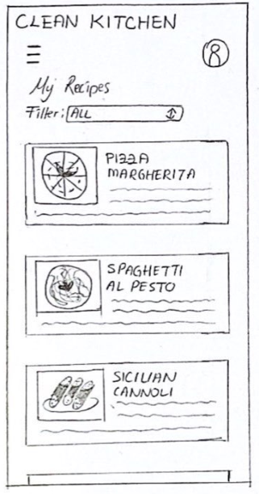

# Milestone 2: Low-Fi Prototyping - Clean Kitchen

## Storyboards

### <!--- blank line -->

| 1 | 2 | 3 |
|:--:|:---:|:---:|
|**4**|**5**|**6**|
|**7**|**8**|**9**|

The storyboard illustrate a typical situation that can happen in a kitchen.

The user wants to cook a new recipe and he encounters some issues during the process. The first problem is about changing the page of the recipe while he’s cooking and he has dirty hands.
The second one is about asking for help in case he has any kind of doubt about the description of the recipe.

The strength is that the user's needs while he’s cooking are easily understandable and this helps the reader to empathize with the user.
The only weakness could be about understanding how the application will help the user when he needs help (figure 6-7), due to the fact that we thought about different kinds of implementations and we didn’t want to specify one.

## Paper Prototypes

These prototypes tackle the project in two different ways, starting by the type of sensors used to satisfy the user need of having an hygienic workspace, but also differing in the core functionalities and flow of the app.

### Paper Prototype #1

| 1 | 2  | 3  | 4  | 5  | 6  |
:--:|:--:|:--:|:--:|:--:|:--:|
|||||

<table>
  <tr>
    <td width="227">Welcome Tutorial Screen 1</td>
    <td width="227">Welcome Tutorial Screen 2</td>
    <td width="227">Main user screen with the overview of his/her recipes</td>
    <td width="227">An example of recipe screen with the details of the recipe and a timer to set</td>
    <td width="227">Subsequent screen of the recipe example</td>
    <td width="227">The "social" screen composed of user's registered friends, a search bar to search for them, a button to invite them</td>
  </tr>
</table>

#### Flow

#### Description

CleanKitchen enables people to cook using their saved favourite recipes or their friends’ ones, all without touching the screen, by using the proximity sensor to navigate through the various steps.

## <!--- blank line -->

### Paper Prototype #2

| 1 | 2  | 3  | 4  | 5  |
:--:|:--:|:--:|:--:|:--:|
|||||

<table>
  <tr>
    <td width="227">Home page with search functionalites (by keyword and filters) and suggested content</td>
    <td width="227">Search results page with results and filter options</td>
    <td width="227">Chosen recipe overview, with button to enter in "cooking mode"</td>
    <td width="227">Tutorial popup showing how to use the app functionalities</td>
    <td width="227">"Cooking mode" screen with voice recognition enabled</td>
  </tr>
</table>

#### Flow

#### Description

This prototype is focused on the possibility to use a voice recognition system that, by saying a keyword, enables the user to navigate the various steps of the recipe and to ask for help if needed. Thus, as presented in the project description, giving the user the ability to keep an high level of hygiene by not requiring him to touch his phone during the cooking process, while also giving an option to receive some help if needed.

## Selection Rationale

### Prototype #1 Pros and Cons

#### Pros

- Welcome Tutorial
- Ability to set a timer
- Ability to use touch while cooking, not just the sensor

#### Cons

- Missing search functionalities
- Tutorial visible only at the start of the app
- No way to exit the "cooking mode"
- Sensor may be easy to trigger

### Prototype #2 Pros and Cons

#### Pros

- Search functionalities
- Smaller and more clear recipe steps when in "cooking mode"
- Tutorial reminder before entering in "cooking mode"
- System status is clear to the user while in "cooking mode":
    - An icon signals when the voice recognition is active and listening to queries
    - The progress is clearly visible at the bottom

#### Cons

- Missing a Welcome Tutorial
- No way to exit the "cooking mode"
- Missing an alternative way to interact while in "cooking mode"
- Missing some text descriptions on the home page
- Sensor may catch unwanted queries

### Selection

We decide to choose the Prototype #2 as a base to continue our exploration. However, the Prototype #1 includes some interesting features that we're going to merge to the base:

- The two sensors may work better together to accomplish our goal of interacting with the app without being forced to use the touchscreen. (e.g. we can use the proximity sensor to trigger the start of the voice recognition process).
- The Welcome Tutorial is necessary to explain to the user how our app works from the beginning.
- The user should still be able to use the touchscreen while in "cooking mode".
