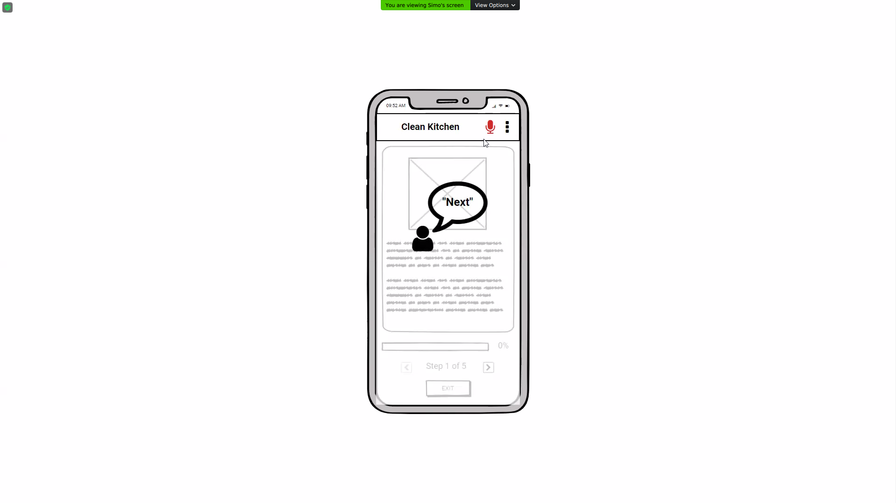

# Milestone 3: Wireframe and Heuristic Evaluation - Clean Kitchen

## Wireframe

| Wireframe PDF | [link](res/Wireframe_M3.pdf) |
|:----:|:----:|

The wireframe was built using [Balsamiq Cloud](https://balsamiq.cloud/).
Working on this wireframe we kept in mind the issues and cons emerged from the outcome of M2 during the analysis and the selection of the prototype.
We integrated a Welcome Tutorial and made sure that the user had a familiar way of interacting with the app using standard and well-known actions (buttons), instead of the novelty represented by the use of the proximity sensor and voice recognition.
We addressed the lack of some UI elements, such as back/exit buttons to guarantee a non-disruptive navigation through the app.

We focused mainly on what we thought were the most important part of the application (main features, multimodal interaction, navigation) and less on the content (e.g. the Welcome Tutorial is currently generic since we’re waiting to see how the implementation of the features plays out).

- Page 1, 2: Welcome Tutorial - Tutorial showing how to use the app.
- Page 3: Home - The user can search a recipe by keyword or selecting a category (&#8594; page 5); he can also choose a recipe among the ones suggested (&#8594; page 6). A menu is also accessible anytime from the app bar (&#8594; page 4).
- Page 4: Show Menu - The user can change some settings (not implemented, e.g. language) or look again at the tutorial.
- Page 5: Search Results - Landing page after a search (either by keyword or category); the user can search for something else or select a recipe (&#8594; page 6)
- Page 6, 7: Recipe Overview - (The two pages are the same, used as a workaround to fix “back” navigation) The user can read an overview of the recipe and start the “Cooking Mode” when ready (&#8594; page 8).
- Page 8: Cooking Mode Tutorial Dialog - A quick reminder on how to use the app (&#8594; page 9).
- Page 9, 11: Cooking Mode - The user can use multimodal interaction to navigate through the steps (swipe on the proximity sensor to activate the voice recognition process, touch buttons at the bottom).  
- Page 10: Voice Recognition - Workaround to portray the use of voice recognition after being activated by swiping on the proximity sensor.

## Heuristic Evaluation

The facilitator briefly explained the scope and the main features of the app before letting the evaluators free to explore and examine the wireframe. There were no task prepared for the evaluators, since we believed that the navigation was pretty simple and linear.
The facilitator was always available to give support and answer questions, the main ones regarding the multimodal interaction (see picture below): since it was difficult to portray the interaction with physical sensors (proximity sensor and microphone), we left most of it to the facilitator to explain.

The evaluation was carried out by the Wallet Manager team, and their results are available on a spreadsheet at this [link](<https://docs.google.com/spreadsheets/d/1-rPi7WNKPGi0WxXWe9Yaszs-QMVgsihDdqkUHmvLkBU/edit?usp=sharing>).

### Potential Changes

After discussing the evaluation results, we didn’t find any major (non-trivial) issue that needs to be addressed. We share some of the observations they made (#3 from both of the evaluators, see spreadsheet linked above):

- We’ll make sure to add all the important information needed by the user to be sure that the chosen recipe suits them
- We’ll ensure that the user will have all the necessary pieces of information during each step of the recipe to avoid the need of going back to check something (ingredients, doses etc.)

Regarding issue #1 by evaluator #2, we acknowledge it is a nice feature to have, but we didn’t have any plan to include any feature linked with the ability for a user to have a personal account. However, having received that input, we will consider adding this feature.
