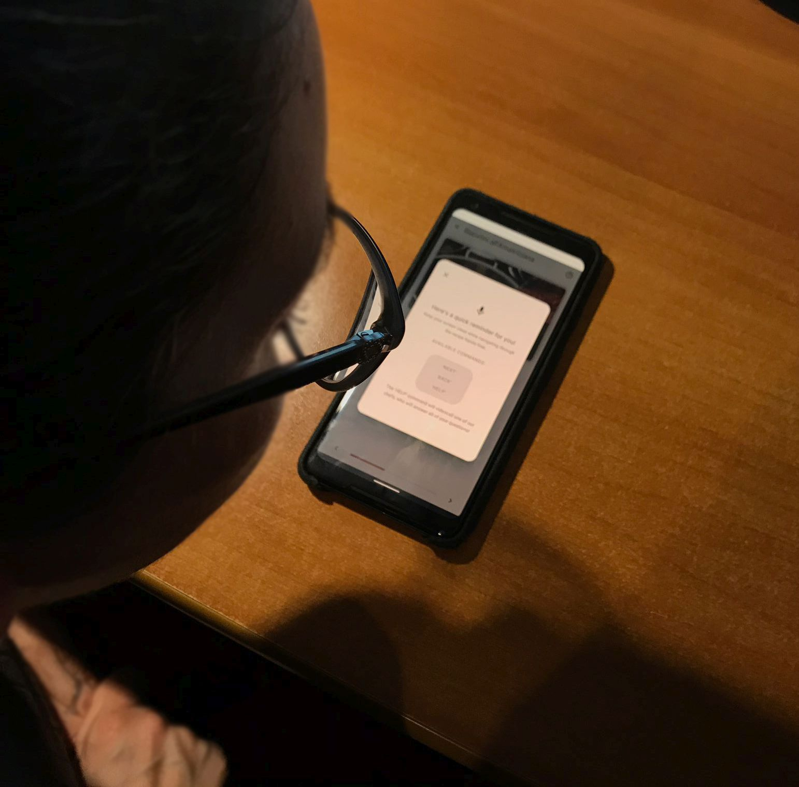
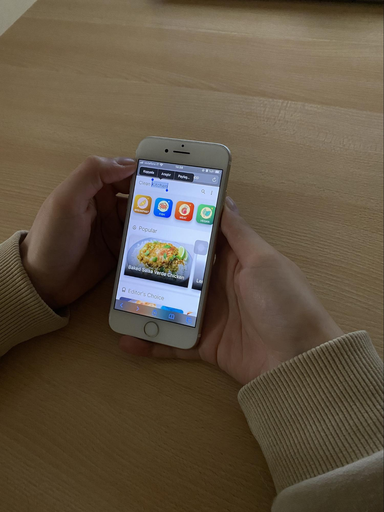
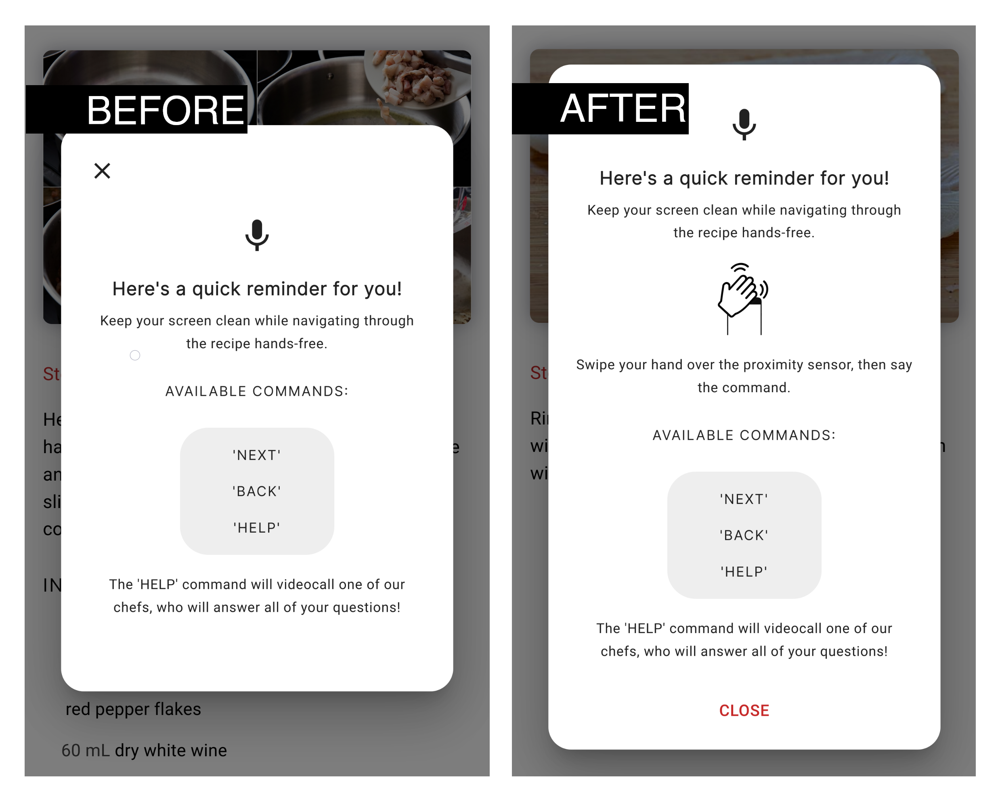
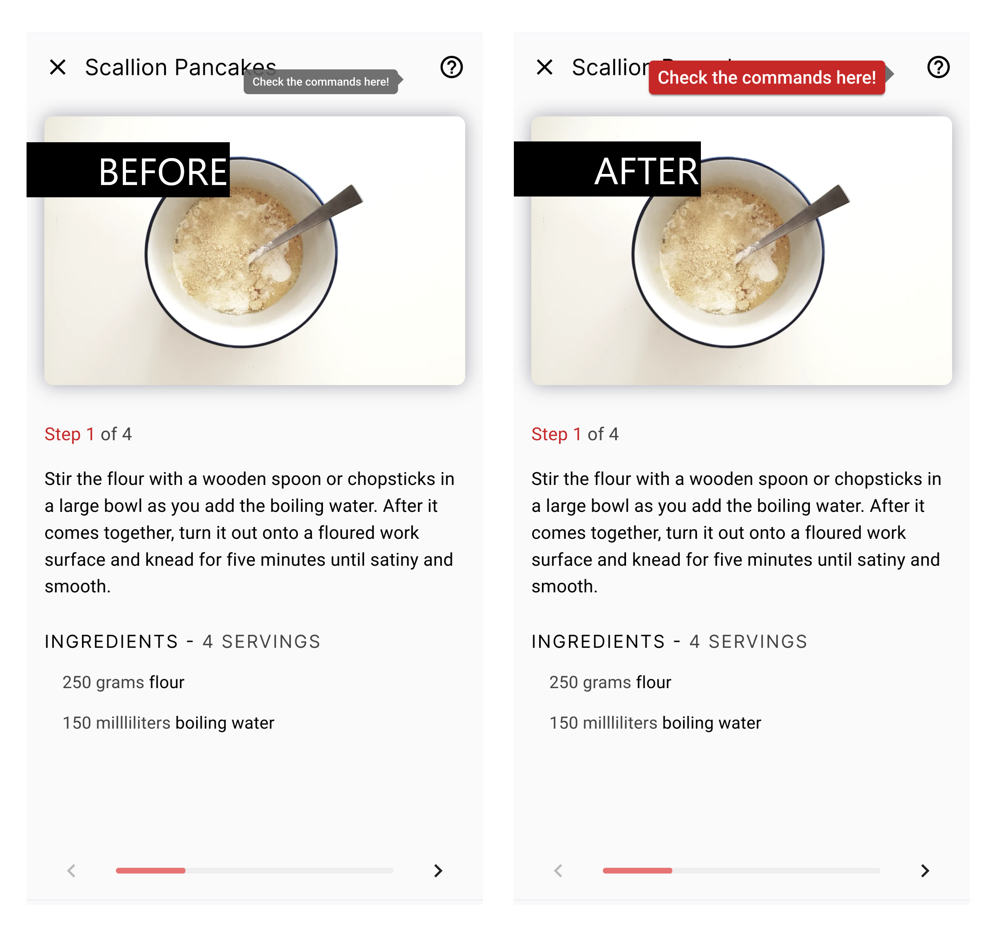

# Milestone 4: Usability Testing - Clean Kitchen

## Overview and Script
The evaluation was based on the sample draft we worked on during class hours.
Due to the current situation (pandemic and end of term exams), the evaluation was conducted over multiple days: one team member hosted its friend/relative and acted as the facilitator. The rest of the team joined a video call acting as observers and notetakers.
Due to the nature of this setup, the facilitator also doubled as notetaker being in a better position to observe the participant using the app directly on the smartphone.

The observation’s highlights were recorded through notes. The evaluations were then discussed among us and their data was then aggregated.

The Usability Testing protocol we developed is available at the link below, and it contains also the consent form, pre- and post-questionnaires.

| Usability Testing plan PDF | [link](res/M4_Usability-Testing-Plan.pdf) |
|:----:|:----:|

## Results and List of Changes
#### Participants
- 4 participants
- Age: 23-35
- Expertise: the participants use their mobile devices (smartphone/tablet) to look for recipes, and they do so 2 times/month on average.
All of them use at least one other app (e.g. Giallozafferano) or website for the same purpose.

### Results

|             |T1 |T2 |T3  |T4  |T5A|T5B|T6  |T7  |T8 |T9  |T10 |
|-------------------|:---:|:---:|:---:|:---:|:---:|:---:|:---:|:---:|:---:|:---:|:---:|
|**Success (y/n)**|y  |y  |y   |y   |y  |y  |y   |y   |y  |y   |y   |
|**Time (sec.)**|/  |/  |~ 60|~ 20|~ 5|~ 5|~ 15|~ 10|~ 2|~ 65|~ 15|
|**Non-critical errors**|/  |/  |/   |/   |/  |1  |/   |/   |/  |3   |/   |

This table summarizes the results gathered from the analysis of the tasks using the selected metrics. All the tasks were completed successfully by all the participants and the average time taken for each task reflects our expectations except for T9, which is the task where there have also been **4 non-critical errors** (among 3 of the participants).
- Two of the users has difficulty remembering how to trigger the voice recognition *(1)*
- One of the users doesn’t perceive the tutorial reminder as a dialog that needs to be dismissed first *(2)*
- One of the users perceives the entire top bar as a searchbox the first time, trying to tap on the title, but quickly recovers tapping on the search button *(3)*

|||
|:---:|:---:|
| *(1), (2)* - The partitipant is stuck on the tutorial reminder dialog without knowing how to proceed |  *(3)* - The partecipant believed the entire top bar was a searchbox|

##### Likes 
- The adjustable servings functionality is really nice to have.
- Good feedbacks (servings adjustments, filters, tooltip reminding you where to check the commands again if you make too many errors).

##### Dislikes
- While the tooltip mentioned above provided good feedback to the user, it was hard to notice at first.

### Findings
During the debriefing one of the participant pointed out that they didn't really liked the idea of calling someone to ask for help, saying that they didn't perceive the app as a 'teaching service' and that they may have preferred to having some videos showing the 'how-to' of each step instead.

One of the participant pointed out that having a 'Favorites' list would be nice to have. We agree on that (as emerged from M3), but we decided to focus on the other area of our prototype. It is definetely an area of improvement.

The participants made positive remarks about the UI, mentioning attractive colors, icons and clarity, simplicity in delivering the information.

##### SUS Scores
- Participant 1 Score: 90
- Participant 2 Score: 82.5
- Participant 3 Score: 92.5
- Participant 4 Score: 87.5

Based on research, a SUS score above a 68 would be considered above average, so we consider these results a pretty good indicator for our prototype.

### Potential changes
- The participants had trouble remembering to swipe over the proximity sensor in order to trigger the voice recognition: we need to improve the tutorial reminder and add this piece of information (as seen in figure 1 below).
- The participant didn't understand right away that the tutorial reminder dialog had to be dismissed: we removed the `X` button from the top left and added a more prominent and descriptive `CLOSE` button to the bottom (as seen in figure 1 below).
- The tooltip in figure 2 is not really noticeable: it may be useful to increase its size and change its color.
- Following the remark about the usefulness of the video call, it may be possible to scrap the current implementation and add help videos to each step instead. However, this requires a lot of time to find/create the needed content, hence it is postponed as of now.
- One of the user pointed out that having a 'Favorites' list would be nice: this would be definetely a todo in a roadmap for future development.
- One participant missed the possibility of manually typing in the time inside the filter menu, and the servings number: this was alredy considered valuable by us (see [issue #13 on Github](<https://github.com/polito-hci-2020/clean-kitchen-code/issues/13>) from Jan 7), but we encountered a few issues with the implementation.
- One piece of feedback we received mentioned the absence of directions in the recipe screen: we agree and we added them below the ingredients section.

|||
|:---:|:---:|
| *Figure 1* | *Figure 2* |

